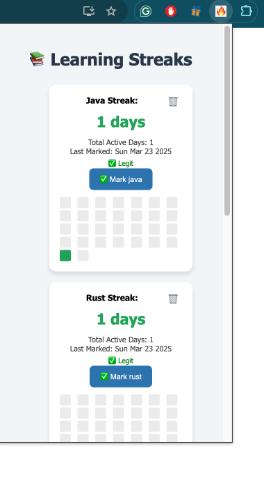

# Learning Streak Tracker – System Overview

This Chrome extension helps you track daily learning streaks per topic (like "Java" or "Go"). You can mark a topic as done for the day, see your current streak, and visualize it on a 30-day heatmap. It also lets you back up your streak data to Google Sheets.

---

## How It Works

### Popup (popup.html + popup.js)
- Shows all your learning topics
- Lets you mark a topic as done for today
- Tracks your current streak and active days
- Shows a small 30-day heatmap
- Has buttons to add/remove topics and back up data

### Storage
- Uses `chrome.storage.sync` to store:
  - `topics` list
  - For each topic:
    - `streak_<topic>`
    - `lastMarkedDate_<topic>`
    - `history_<topic>` (array of dates you've marked it)

### Background Script (background.js)
- Sets a daily reminder using Chrome's alarms API
- Sends a notification once a day

### Google Sheets Backup
- Authenticates with your Google account using OAuth
- Pushes all topic data to a sheet you control
- Uses the Google Sheets API to write rows with:
  - Topic, Streak, LastMarked, TotalDays, History (as JSON)

---

## Setup (for contributors)

1. Clone the repo
2. Create your own Google Cloud project
3. Enable the Google Sheets API
4. Create an OAuth Client ID for Chrome Apps
5. Replace the placeholder client ID in `manifest.json`
6. Load the extension via `chrome://extensions` > "Load unpacked"

---

## Optional Features You Can Add

- Restore from Google Sheets
- Longest streak tracking
- Auto backup on mark
- Dark mode

---

Built for personal use, but open to contributions.

